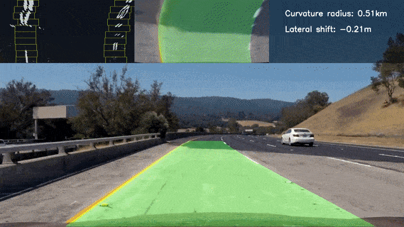
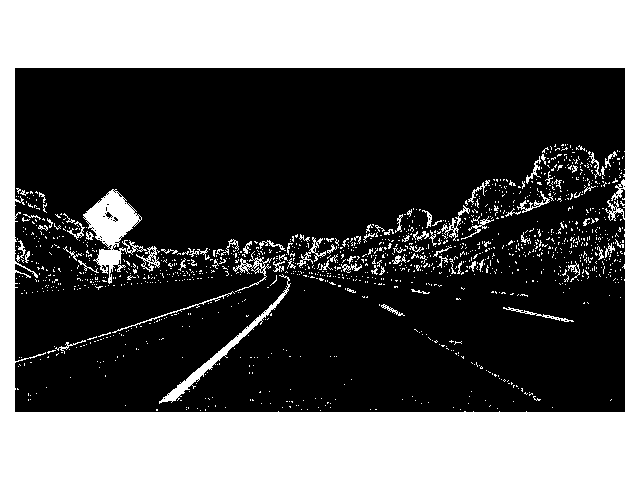
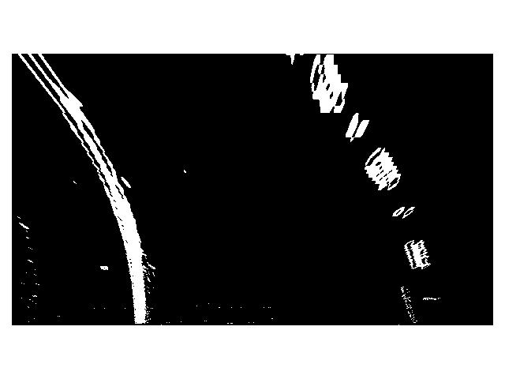
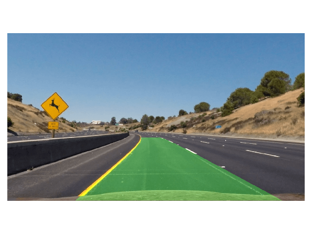
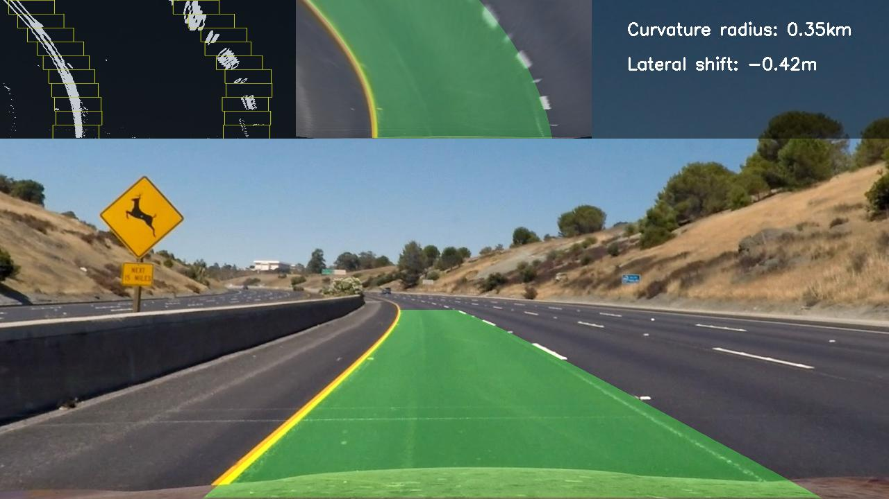

# Advanced lane finding
[](LICENSE) [](https://www.codacy.com/manual/frgfm/sdcnd-p2-advanced-lane-finding?utm_source=github.com&amp;utm_medium=referral&amp;utm_content=frgfm/sdcnd-p2-advanced-lane-finding&amp;utm_campaign=Badge_Grade) [](https://circleci.com/gh/frgfm/sdcnd-p2-advanced-lane-finding) [](https://codecov.io/gh/frgfm/sdcnd-p2-advanced-lane-finding)

This repository is an implementation of non-learning pipeline for the advanced lane finding project of Udacity Self-Driving Car Nanodegree (cf. [repo](<https://github.com/udacity/CarND-Advanced-Lane-Lines>)).




## Table of Contents

- [Getting Started](#getting-started)
  - [Prerequisites](#prerequisites)
  - [Installation](#installation)
- [Usage](#usage)
- [Approach](#Approach)
- [Credits](#credits)
- [License](#license)


## Getting started

### Prerequisites

- Python 3.6 (or more recent)
- [pip](https://pip.pypa.io/en/stable/)

### Installation

You can install the project requirements as follows:

```shell
git clone https://github.com/frgfm/sdcnd-p2-advanced-lane-finding.git
cd sdcnd-p2-advanced-lane-finding
pip install -r requirements.txt
```

If you wish to reproduce results shown further below, you can download [calibration](https://github.com/frgfm/sdcnd-p2-advanced-lane-finding/releases/download/v0.1.0/camera_cal.zip) and [testing samples](https://github.com/frgfm/sdcnd-p2-advanced-lane-finding/releases/download/v0.1.0/test_samples.zip) and extract each archive in the repository main folder.

Alternatively, provide your own calibration and testing samples.


## Usage

All script arguments can be found using the `--help` flag:

```shell
python src/main.py --help
```

Below you can find an example to detect lanes in an image and in a video:

```shell
python src/main.py test_images/test2.jpg
python src/main.py test_videos/project_video.mp4 --video
```


## Approach

This detection approach was designed to avoid a learning procedure and only requires camera calibration to perform lane segmentation.


### Camera calibration

Cameras use lenses to focus light into their sensor, but also perform distortion in the process. Fortunately, this side effect can easily be tackled with camera calibration.


Using a well-defined shape, that can automatically be detected, such as a chessboard image, we can compute the camera matrix (coefficients describing the exact distortion taking place). The distorted points of the chessboard (distorted chessboard) on the image are mapped to the prior knowledge about the real-world shape (perfect grid here).


### Line isolation

The image's distortion being corrected, isolating the lanes is now our main goal. In order to do this, we perform several filtering operations using OpenCV.



In this specific implementation, we use the combination of:

- mask of filtered values in HLS colorspace (on saturation channel)
- mask of filtered sobel values in RGB colorspace (color gradient)

which produces the above result.

For detailed explanations about a canny edge detection alternative, please see this [repo](https://github.com/frgfm/sdcnd-p1-lane-detection).

### Perspective warping

Using a predefined depth view prism (selecting on the car view, points that would form a perfect rectangle from birdeye view), we can apply perspective warping to ease our line fitting.

In order to do so, we use pictures with straight lanes, and adjust the prism until the warped result displays vertical straight lines.



On a left curve image, the warped result looks like the above representation.


### Polynomial regression

Using the lower half horizontal histogram of the previous image, we can get rough estimates of both lanes' centers. From there, we can follow an iterative process described as follows:


- Set a horizontal margin, and a number of windows
- For the number of windows, perform
  - take the current lane center estimate with the margin
  - store the points inside this box
  - update the lane center to the mean of the stored points
- Fit a 2nd order polynomial regression on the points to get $x = f(y)$
- Use the coefficients to extrapolate the lane positions



The above result is obtained by filling the detected lane.


### Radius of curvature

For a function $f(y)$ giving the horizontal coordinates from the vertical ones, we can define the radius of curvature:
$$
R_{curve} = \frac{[1 + (\frac{dx}{dy})^2]^{3/2}}{|\frac{d^2x}{dy^2}|}
$$
But since $f(y) = Ay^2 + By + C$, then $f'(y) = 2Ay + B$ and $f''(y) = 2A$

which translates to
$$
R_{curve} = \frac{[1 + (2Ay + B)^2]^{3/2}}{|2A|}
$$
Using the regression results, we can get the curvature with the above formula. However, the radius of curvature is only useful if given in meters (and not pixels). To do this, we can either refit our polynomial regression on converted points in meters, or directly scale the pixel coefficients to meter coefficients. The later was used in this implementation for efficiency purposes.


### Lateral shift

A last piece of information can be extracted with our previous work. Since we have the extrapolated lines, considering the camera is at the middle of the car, we can estimate the distance from the lane center. 

Taking the mean of both bottom parts of the lines, we can get the lane center, while the middle of the image on the horizontal axis would give the lateral position of the car.


### Final result

For improved clarity, we can overlay the key information for easier debugging on the image.



The user interface is split into 4 parts:

1. **top left panel**: shows the regression boxes on top of the bird-eye mask.
2. **top center panel**: shows the extrapolated lines in bird-eye view.
3. **top right panel**: gives live estimation of curvature radius and lateral shift.
4. **lower panel**: colored lane detection overlayed on the original image


Note: a further improvement would be to use previous frames detections to avoid going through the whole box regression process.


## Credits

This implementation is vastly based on the following methods:

- [Camera Calibration](https://opencv-python-tutroals.readthedocs.io/en/latest/py_tutorials/py_calib3d/py_calibration/py_calibration.html)

- [Colorspaces](https://en.wikipedia.org/wiki/HSL_and_HSV)
- [Canny edge detection](https://opencv-python-tutroals.readthedocs.io/en/latest/py_tutorials/py_imgproc/py_canny/py_canny.html)
- [Polynomial regression](https://en.wikipedia.org/wiki/Polynomial_regression)


## License

Distributed under the MIT License. See `LICENSE` for more information.